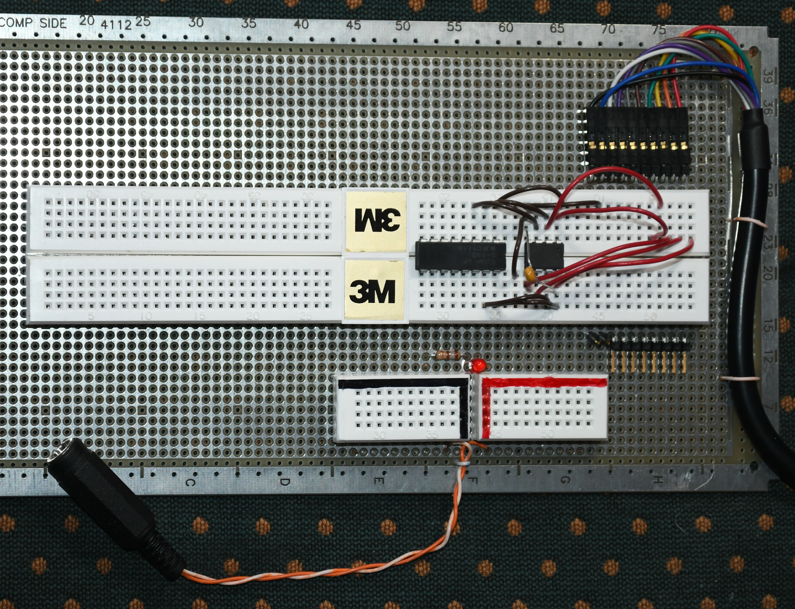

# ftdi_mpsse
## Workspace for utilities to run on the FTDI MPSSE devices

The C232HM-EDHSL and C232HM-DDHSL devices from FTDI provide
a Multi-Protocol Synchronous Serial Engine (MPSSE)
that is capable of running in an SPI mode. The MPSSE
is connected to the host via USB. SPI devices may be
interfaced to the MPSSE and accessed directly from the host.
This allows exploration and debug of the SPI device,
and even provides a simple programming capability
for SPI-connected flash-memory devices.

http://www.ftdichip.com/Support/Documents/DataSheets/Cables/DS_C232HM_MPSSE_CABLE.pdf

Note, Application Note 108 (AN-108), referenced in the datasheet, has a wealth
of information on the MPSSE commands to setup the interface to the target device.

Interfacing to SPI devices typically requires more than simple connection,
as (at least) pull-up resistors are often required on certain pins.
It may be beneficial to build a breadboard interface, such as

